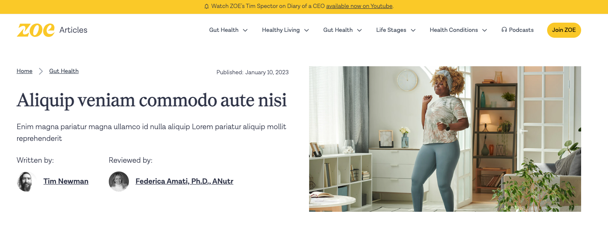

# ZOE Blog Clone

This project is a clone and rework of the [joinzoe.com blog](https://joinzoe.com/blog). The aim is to recreate the blog using [DatoCMS](https://www.datocms.com/) and [Next.js](https://nextjs.org/) on my own. The project is build with DatoCMS, Next.js, HTML & Tailwind CSS.

## Screenshot

## Motivation

My current employer [ZOE](joinzoe.com) use a great combination of Next.js and DatoCMS. This combo is lightning fast on the front end and very intuitive on the back end.

I wanted to better understand the relationship with DatoCMS and Next.js and, in particular, learn how to interact with the Dato API and map models to components.

Additionally I wanted to add design & UX improvements across the site section as a good example of opportunities for improvement.
