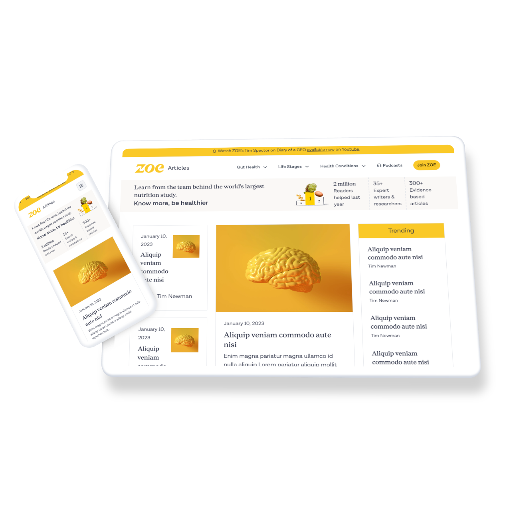

# ZOE Blog Clone

This project is a clone and rework of the [joinzoe.com blog](https://joinzoe.com/blog). The aim is to recreate the blog using [DatoCMS](https://www.datocms.com/) and [Next.js](https://nextjs.org/) on my own. The project is build with DatoCMS, Next.js, HTML & Tailwind CSS.

## Screenshot



## Built With

- [Next.js](https://nextjs.org/) - The web framework used
- [DatoCMS](https://www.datocms.com/) - The headless CMS used
- [Tailwind CSS](https://tailwindcss.com/) - The utility-first CSS Framework used

## Getting Started

To get started, clone the repository and install the dependencies:

```console
git clone https://github.com/adamddurrant/zoe-clone.git

cd /zoe-clone

npm install
```

## Running the app

To run the app in development mode you will need my environment details.

I am happy to share for a short period of time if you'd like to run the site locally, please [reach out](https://adamdurrant.co.uk). Once you have the .env file setup:

```console
npm run dev
```

To build the app for production:

```console
npm run build
```

To start the app in production mode:

```console
npm start
```

## Motivation

[ZOE](joinzoe.com) uses an awesome combination of Next.js and DatoCMS. This combo is lightning fast on the front end, has tons of features and is very intuitive on the back end.

I wanted to better understand the relationship with DatoCMS and Next.js and, in particular, learn how to interact with the CMS API by building models and mapping models to components.

Additionally I wanted to add design & UX improvements across the site section as a good example of opportunities for improvement.

## License

This project is licensed under the MIT License - see the LICENSE.md file for details

## Acknowledgments

Huge appreciation to [Hannah King](https://github.com/hantastic) for supporting me when I got stuck with GraphQL queries.
